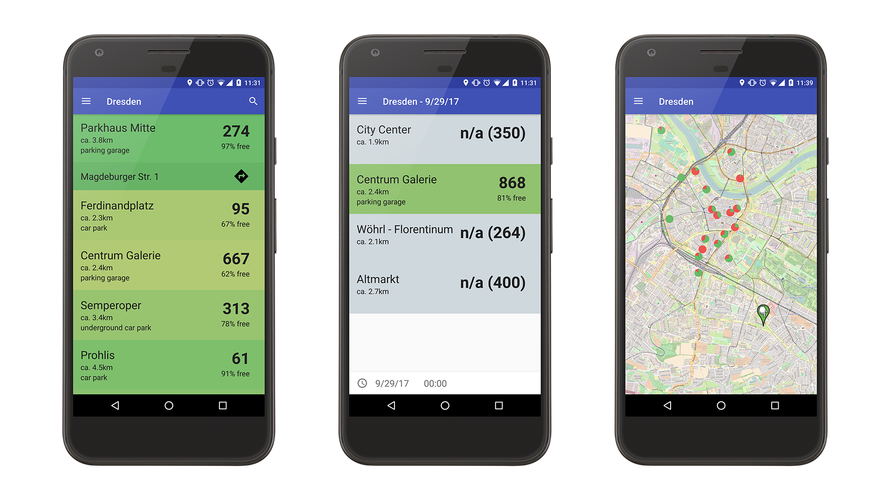

ParkenDD
========

An android application to find free parking sports in Dresden and other cities.

## Features

* See how many free places are available in the parking spots near you
* Find out how busy parking spots will be at a certain date and time
* Display a map showing all your city's parking spots

## Translation
ParkenDD is available in several languages including English, German and French.
If you want to contribute a translation be free to do so on [poeditor.com](https://poeditor.com/join/project/eu2wqvnR4z)!

## Licenses
Licenses can be viewed in the files LICENSE and LICENSE-EXTRA.

